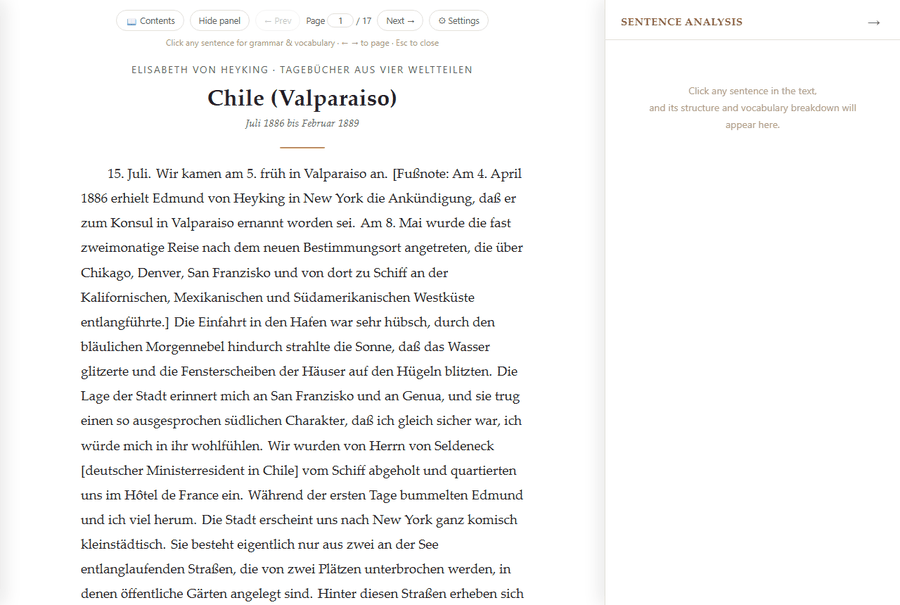

<div align="center">

<p align="right">English · <a href="README.zh.md">简体中文</a></p>


# Lingua Lector — AI-Powered Close Reading for Foreign-Language Texts

**Single file, pure frontend, BYOK.** Load any foreign-language text, click a sentence, and
the AI takes it apart for you — with your own API key, no account, no backend.

[](LICENSE)


</div>

## What it is

This is a reader built specifically for Elisabeth von Heyking's German diary *Tagebücher aus
vier Weltteilen* — but you can absolutely read other things with it!

Seriously, though: load a text (`.txt` / `.docx` / `.pdf` / `.epub`, or pasted straight in),
and it comes back split into clickable sentences. Click one and the right-hand panel gives
you its structure and its vocabulary, with follow-up questions available underneath. The
whole tool is one HTML file you open by double-clicking it. The diary ships inside it as the
example book, and can be deleted.



## Why this exists

This book is written in long sentences. One main clause can hold a `nachdem` adverbial
clause, stack two layers of `daß` object clauses inside it, and take on two appositions and
two relative clauses along the way, running to nearly nine hundred characters without
coordinating once (the record holder, shown just below, comes from the introduction by the
book's editor, Grete Litzmann, and von Heyking herself is not much gentler). The 1926 volume
reads like that throughout: a German diplomat's wife writing from Valparaíso, Calcutta,
Cairo, Peking and Mexico, in century-old German.

Which makes reading it go: read a sentence, stop, look a word up, untangle the clauses,
realise you've forgotten how the sentence started, go back, re-read, move on. Ten stops a page.

This tool exists to remove those ten stops: click a sentence, and the panel tells you how
it's built, what each clause says, and which words are worth remembering. Then you read on.
It turned out other books needed this too, so it grew into a general close-reading tool for
any Latin-alphabet text.

## One example

One of the longest single sentences in the book, from the editor's introduction:

> Nach einjährigem Urlaub, den das Paar in völliger Stille in Florenz verlebt, nimmt er
> schweren Herzens eine Anstellung als stellvertretender Konsul in New York an, nachdem
> Freunde im Auswärtigen Amt in Berlin ihm versichert haben, daß seinem Übergang aus der
> Konsulatskarriere in den eigentlichen diplomatischen Dienst bei allernächster Gelegenheit
> nichts im Wege stände; ein verhängnisvoller Irrtum, bei dem für jeden, dem die Verhältnisse
> im diplomatischen Dienst in den achtziger Jahren bekannt sind, die Vermutung naheliegt,
> dieser freundschaftliche Rat sei, den Gebern vielleicht selbst nicht bewußt, mit davon
> beeinflußt gewesen, daß Heykings Ausscheiden aus dem Amt in Berlin seine Freunde der
> Aufgabe überhob, sich öffentlich zu ihm zu bekennen, eine Aufgabe, die allerdings
> angesichts des höfischen Einflusses seiner Gegner ein großes Maß von Selbständigkeit
> erfordert hätte!

One main clause, a `nachdem` adverbial clause, two layers of `daß` object clauses, two
appositions, two relative clauses, and nearly nine hundred characters held up entirely by
subordination. Taking that apart is what the tool does:


## Features

- **Sentence-level analysis with follow-ups**: a translation of the whole sentence, its
  backbone, and **a translation of every subordinate clause** — not just "relative clause,
  modifies *Kaiser*", but what that half of the sentence says. The enclosing paragraph goes
  along as context, while the analysis stays strictly scoped to the sentence you clicked
- **Answers stay local**: cached per document, surviving refreshes and document switches
  without paying for the same sentence twice. Re-analyse a single sentence you don't like,
  or clear one document's cache, without wiping everything
- **Document library**: the built-in book plus as many imports as you like, each with its own
  cache and reading position. Text and caches live in IndexedDB (falling back to
  `localStorage`), so a several-hundred-page book fits, and the library shows what each costs
- **Multi-format import**: `.txt` / `.docx` / `.pdf` / `.epub`, all parsed in the browser —
  files never leave your machine
- **PDF that actually reflows.** A normal PDF reader draws you a photograph of a page: the
  type is whatever size the typesetter chose in 1926, and your only controls are zoom and
  pan. This one *rebuilds the text* — lines regrouped from their coordinates, running headers
  and page numbers stripped, footnotes kept whole, hyphenation rejoined, paragraphs
  reconstructed across page breaks — and then lays it out fresh. So a scanned-looking old
  book gets the reading font, the type size, the line width, the theme and the pagination
  *you* want, and its sentences become clickable like any other text. Chapters come from the
  PDF's own bookmarks where it has them (nested outlines are merged, so an anthology reads
  "Author: Title" rather than a bare list of authors); where it has none, a changing running
  header is used to find the sections
- **Multiple AI providers**: Anthropic Claude, any OpenAI-compatible endpoint (DeepSeek,
  Groq, NVIDIA, a local Ollama), and Google Gemini, each with its own key, model and base URL
- **Three language settings that don't affect each other**, in any combination: what language
  the interface is in (9), whose sentence-splitting rules apply to the source text
  (11 Latin-alphabet languages plus a generic fallback), and what language the AI writes its
  analysis in (15, or type your own). German source, Chinese interface, English analysis is a
  perfectly ordinary setup
- **Table of contents**: a slide-out chapter list for whatever you're reading, built from the
  document's own structure
- **Built-in book**: all 12 chapters of *Tagebücher aus vier Weltteilen*; delete it if you
  don't want it, restore it with one click
- **Reading settings**: paginate by paragraph count, adaptive one-screen pages, or no
  pagination; light / dark / sepia; adjustable reading font and size

## Quick start

### On a computer

1. Download `dist/lingua-lector.html`
2. Open it in a browser (Chrome / Edge / Firefox)
3. The settings panel opens on first launch — pick a provider and paste in your API key
4. The built-in book is there to read; or import a file / paste text under the Document tab
5. Click any sentence. Press ⟳ on the panel to redo an answer you don't like

### On a phone or tablet

**Open the hosted copy — don't download the file.**

**<https://slimplanet92805.github.io/lingua-lector/>**

That is the same single file, served over `https`. The layout adapts to a narrow screen, the
pager sits on its own row, and tapping a sentence works exactly as clicking one does. Use
"Add to Home Screen" if you want it to feel like an app. Your key and library live in that
browser's storage on the device, the same as on a desktop — nothing is sent anywhere except
to the AI provider you configured.

If your browser offers to translate the page, the text you are reading stays in its original
language whatever you answer: it is marked untranslatable, because replacing the sentences
you came to study with a machine translation would defeat the point. Everything else — menus,
the analysis — is already in whichever language you picked in settings.

A downloaded `.html` will *not* work on a phone, and this is not something the file can fix:

| | what happens | why |
|---|---|---|
| **Android** | app opens, tapping a sentence never reaches the AI | browsers refuse network requests from a `file://` page |
| **iOS** | not even the text appears | iOS cannot open a local `.html` as a web page at all; the Files app shows it in Quick Look, which doesn't run JavaScript |

Both are how the platforms sandbox local files. Serving the file over `https` removes them.

**Prefer to keep everything on your own network?** `server.py --host 0.0.0.0` serves the app
to your phone from your computer — see [Optional proxy](#optional-proxy) below. That route is
also the only one where your API key never touches the phone at all.

### When the hosted copy is the wrong choice

The hosted page is served from `https://…github.io`, and browsers deliberately stop a public
`https` page from reaching services on your own machine or local network. So use the
downloaded file (plus `server.py` where noted) if any of these is you:

- **You run a local model** — Ollama, LM Studio, llama.cpp, vLLM, LocalAI, anything on
  `http://localhost:…`. A public page cannot reach it: browsers gate requests from a public
  site into your private network, and your model server won't be answering those checks. Open
  the file locally instead, or run `server.py --openai-base-url http://localhost:11434/v1`
  and point the app at the proxy. **This is the main case.**
- **You use the `server.py` proxy** — it is a small program on your own machine and serves over
  plain `http` (`http://localhost:8787`, or `http://192.168.…` on your LAN); it has no https
  certificate and needs none. An `https` page is *not allowed* to call an `http` address (the
  browser's mixed-content rule), and that is not a setting you can change. So when you run
  `server.py`, use the page it serves — it opens it for you — rather than the hosted copy. A
  Cloudflare Worker is unaffected, being itself `https`.
- **You need it fully offline** — the hosted copy has to be fetched before it will run.
  The downloaded file doesn't (the AI call still needs the network, unless it's a local
  model, in which case the whole thing runs with no internet at all).
- **You'd rather GitHub not see you load it**, or you're on a network where `github.io` is
  blocked. The file is byte-for-byte the same either way — this is only about who observes
  the page load.

Everyone else — anyone using Anthropic, OpenAI, Gemini or another hosted provider with their
own key — should just use the hosted copy, especially on a phone.

## API keys

- **Anthropic Claude**: [console.anthropic.com](https://console.anthropic.com/settings/keys)
- **OpenAI** (or DeepSeek / Groq / NVIDIA / a local Ollama — point the Base URL at it):
  [platform.openai.com](https://platform.openai.com/api-keys)
- **Google Gemini**: [Google AI Studio](https://aistudio.google.com/apikey)

Create a dedicated key for this tool and give it a spend limit.

**Opening this HTML file as a claude.ai Artifact** (how the project started): pick Anthropic
and leave the key blank — requests go through claude.ai's sandbox proxy on your current
session. That fallback is Anthropic-only.

## Where the key lives

In your browser's `localStorage`, on this device, and nowhere else; it is never sent anywhere
except the provider's own endpoint. It isn't part of the HTML file, so forwarding that file
or pushing it to GitHub hands someone an empty settings panel. The only real exposure is
someone else using this device — so don't leave a key on a shared computer.

If you would rather the key not sit in the browser at all, the proxy below moves it
server-side, and the browser never touches the real one.

## Optional proxy

Anthropic and Gemini both allow direct cross-origin calls from a browser, so normally no
proxy is needed. Some OpenAI-compatible providers don't, which shows up as "network request
failed" — a proxy works around that, and can hold the key for you as well.

**`server.py`** (needs Python, no third-party dependencies) relays API requests and also
serves `dist/lingua-lector.html` over `http://`, opening it for you:

```bash
# relay only, no security benefit: the key still comes from the browser
python3 server.py

# key held server-side; the browser never sees a real one
python3 server.py --anthropic-key sk-ant-... --openai-key sk-... --gemini-key AIza...
```

If you passed a key flag, there is nothing to set up in the app: the page served at
`http://localhost:8787/` is told which providers the proxy holds a key for and fills in
their Base URL itself, so just pick that provider and start reading — leave the API key
field empty. For a provider you did *not* pass a key for, set its Base URL by hand to
`http://localhost:8787/anthropic`, `http://localhost:8787/openai/v1`, or
`http://localhost:8787/gemini/v1beta`.

**Pointing it at a non-OpenAI, OpenAI-compatible host** (NVIDIA NIM, Groq, Together,
DeepSeek, a local Ollama/vLLM…) — the provider's own address goes on the *command line*,
and the app's Base URL field gets the *localhost* one:

```bash
python3 server.py --openai-base-url https://integrate.api.nvidia.com/v1 --openai-key nvapi-...
```

Then pick "OpenAI-compatible" in settings, type the model name (e.g.
`openai/gpt-oss-120b`), and leave the API key field empty — the Base URL is filled in for
you. A trailing `/v1` on `--openai-base-url` is optional; paste the URL exactly as the
provider's docs print it.

> **The two addresses are not interchangeable.** Starting the proxy and *then* typing the
> provider's own address (`https://integrate.api.nvidia.com/v1`) into the app's Base URL
> field routes around the proxy entirely: the browser calls the provider directly and you
> get the very CORS error you started the proxy to avoid. The app now says so in the
> settings panel when it detects it is being served by `server.py`, with a button that
> fills in the right URL.

> **Use the app that `server.py` opens** — the page at `http://localhost:8787/`, not the
> HTML file opened directly. The proxy only answers its own page. A `file://` page reports
> its origin as `null`, and accepting that would let *any* local HTML file call the proxy
> and spend a server-side key, so those requests are refused with a message saying so.
> `--allow-origin` overrides this if you have a reason to.

Remaining
options are in `python3 server.py --help`.

### Serving it to a phone on your own network

By default `server.py` listens on `127.0.0.1`, so only this machine can reach it. `--host`
opens that up:

```bash
python3 server.py --host 0.0.0.0 --anthropic-key sk-ant-...
```

It prints the address to use, e.g. `http://192.168.1.12:8787/`. Open that on the phone — the
app is served, the LAN origin is added to the allow-list automatically, and the Base URLs it
fills in point back at your computer rather than at `localhost` (which on a phone would mean
the phone itself).

This is the best mobile setup if you have a computer to hand: nothing is published, it works
without internet beyond the AI call itself, and with a `--...-key` the phone never holds your
API key at all.

> **Read this before using `--host`.** It exposes the proxy to everyone on the network. With
> a server-side key configured, anyone who can reach your machine can spend it — there is no
> authentication. Fine on a home network you control; **don't do it on café, hotel, airport,
> or campus Wi-Fi.** Stop the server when you're done. On the public hosted copy this
> question doesn't arise, because there is no proxy and no key but your own browser's.

**`cloudflare-worker.js`** does the same on Cloudflare's free tier with nothing installed
locally: create a Worker at [dash.cloudflare.com](https://dash.cloudflare.com), paste in the
full contents of this repo's `cloudflare-worker.js`, deploy, optionally add
`ANTHROPIC_API_KEY` / `OPENAI_API_KEY` / `GEMINI_API_KEY` as secrets under Settings →
Variables, and set the Base URL to `https://your-worker-url/anthropic`.

A Worker has no way to know where you keep your copy of the app, so you must also add a
plain `ALLOWED_ORIGINS` variable naming the page allowed to call it — the literal word
`null` if you open the HTML file from disk, or an origin such as `https://you.github.io` if
you host it. Until that is set the Worker refuses everything, which is deliberate: a Worker
holding a key secret with no origin check is a key anyone who finds the URL can spend.

Both are plain relays that don't log or inspect content; `server.py` binds to localhost only.

## Coverage

| Format | Implementation | Notes |
|---|---|---|
| `.txt` | native `File.text()` | paragraphs split on blank lines |
| `.docx` | [mammoth.js](https://github.com/mwilliamson/mammoth.js) | plain text, no formatting preserved |
| `.pdf` | [pdf.js](https://mozilla.github.io/pdf.js/) | lines grouped by coordinates, headers/page numbers stripped, footnotes preserved, own bookmarks used for chapters; text-layer PDFs only |
| `.epub` | [epub.js](https://github.com/futurepress/epub.js) + [JSZip](https://stuk.github.io/jszip/) | chapters follow the epub's table of contents |

Sentence splitting is verified for German, English, French, Spanish, Italian, Portuguese,
Dutch, Latin, Czech, Polish and Turkish, plus a generic Latin-alphabet fallback. CJK,
Cyrillic and other non-Latin scripts need fundamentally different segmentation, and forcing
them through this algorithm would work badly — that's a known boundary. AI output language
and UI language are not limited this way.

## Known limitations

- Dependencies load from a CDN, so it doesn't work offline (first-time docx/pdf/epub import
  and every analysis call need the network)
- Scanned PDFs need OCR, which this tool doesn't include
- A PDF with no bookmarks imports as a single chapter. "Try to detect headings and split into
  chapters" will attempt it, using a paragraph-shape heuristic: right on cleanly typeset
  books, unreliable on index-heavy ones, so check the result
- Sentence splitting is rule-based and does worse on messy source text (OCR noise)
- Some AI providers don't allow direct cross-origin calls from a browser — see above

## Development

```
lingua-lector/
├── dist/lingua-lector.html   # the only file you actually need
├── examples/                 # source data for the built-in book (public domain), one JSON per chapter
├── src/part1..6              # source split by concern: CSS / body / core / import / render / init
├── build.py                  # concatenates src into dist/lingua-lector.html
├── server.py                 # optional local proxy
└── cloudflare-worker.js      # optional Cloudflare proxy
```

```bash
python3 build.py && node tests/run.js
```

The suite needs nothing but Node — no `npm install`, because a test suite you have to install
first is one that stops getting run. It runs against the **built artifact**, so `build.py`'s
concatenation and placeholder injection are covered too: build first, then test. Run a subset
by filename: `node tests/run.js i18n`.

| File | Covers |
| --- | --- |
| `build-integrity.test.js` | placeholder substitution, tag balance, inline JS syntax, dangling `getElementById` references |
| `i18n.test.js` | key coverage across nine languages, `{placeholder}` consistency, pager rendering, one shared order for all three language lists, buttons named in instructions actually existing |
| `library.test.js` | document-library lifecycle, storage-backend selection and migration, per-document cache isolation |
| `sentences.test.js` | multi-language splitting edge cases plus statistical guardrails over the whole book |
| `properties.test.js` | 2000 seeded pathological inputs, invariants asserted per case, plus an English corpus regression |
| `pdf-layout.test.js` | PDF line assembly, paragraph splitting, heading detection (recall checked against the built-in book, precision against real false positives) |
| `prompt.test.js` | system-prompt literals, translation-label rewriting, chapter-split fallbacks, provider defaults |
| `a11y.test.js` | language tagging, keyboard reachability, live regions and dialog semantics, icon-button names, theme contrast |

## Acknowledgments

- The built-in example text is the complete *Tagebücher aus vier Weltteilen* by Elisabeth
  von Heyking (1926 edition, ed. Grete Litzmann), now in the public domain
- File parsing relies on [mammoth.js](https://github.com/mwilliamson/mammoth.js)
  (BSD-2-Clause), [pdf.js](https://github.com/mozilla/pdf.js) (Apache-2.0),
  [epub.js](https://github.com/futurepress/epub.js) (BSD-2-Clause), and
  [JSZip](https://github.com/Stuk/jszip) (dual MIT/GPLv3)
- Developed mainly with Claude (Anthropic)

## License

AGPL-3.0, see [LICENSE](LICENSE). AGPL rather than MIT so improvements flow back: anyone who
modifies this and runs it as a public service has to publish their modified source. Personal
use, forking, and self-hosting are unaffected.
