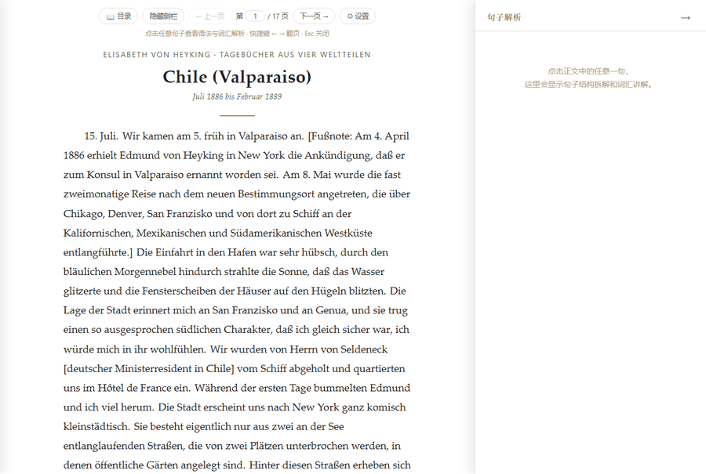
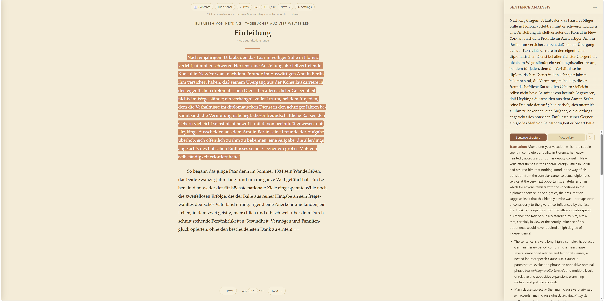

<div align="center">

<p align="right"><a href="README.md">English</a> · 简体中文</p>


# Lingua Lector — AI 交互式外语精读阅读器

**单文件 · 纯前端 · BYOK**：把任意外语文本加载进来，逐句点开，AI 拆给你看。
用你自己的 API key，没有账号，没有后端。

[](LICENSE)


</div>

## 这是什么

这是一个专门用来读 Elisabeth von Heyking 的德语日记《Tagebücher aus vier Weltteilen》的阅读器——
不过你也可以拿它读别的东西！

说正经的：把外语文本（`.txt` / `.docx` / `.pdf` / `.epub` 或直接粘贴）加载进来，正文被切成一句一句
可点击的单元，点哪句，右边就给出这句话的结构拆解和难词讲解，看完还能接着追问。整个工具是一个 HTML
文件，双击就能用。那本日记内置在里面当示例，不需要可以删掉。



## 缘起

这本书里的句子很长。一个主句能套住 `nachdem` 状语从句、里面再叠两层 `daß` 宾语从句、顺手插进两个
同位语和两个关系从句，写到近九百个字符都还没并列过一次（紧接下面这个就是纪录保持者，出自编者
Grete Litzmann 的导言，von Heyking 本人也没客气到哪里去）。1926 年出版的这本日记通篇如此：一位德国
外交官夫人从瓦尔帕莱索写到加尔各答、开罗、北京、墨西哥，用的是一个世纪前的德语。

于是阅读变成了：读一句、停下、查词典、理从句、发现已经忘了这句话开头在讲什么、回去重读、再往下读
一句。一页要停十次。

这个工具就是为了消掉那十次停顿：点一句话，右边告诉你骨架怎么拆、每个从句在说什么、哪些词值得记，
然后你接着读。写完发现需要这么读的不止这一本书，它就长成了一个通用精读器，适用于任何拉丁字母文本。

## 一个例子

书中最长的单句之一，出自编者所写的导言：

> Nach einjährigem Urlaub, den das Paar in völliger Stille in Florenz verlebt, nimmt er
> schweren Herzens eine Anstellung als stellvertretender Konsul in New York an, nachdem
> Freunde im Auswärtigen Amt in Berlin ihm versichert haben, daß seinem Übergang aus der
> Konsulatskarriere in den eigentlichen diplomatischen Dienst bei allernächster Gelegenheit
> nichts im Wege stände; ein verhängnisvoller Irrtum, bei dem für jeden, dem die Verhältnisse
> im diplomatischen Dienst in den achtziger Jahren bekannt sind, die Vermutung naheliegt,
> dieser freundschaftliche Rat sei, den Gebern vielleicht selbst nicht bewußt, mit davon
> beeinflußt gewesen, daß Heykings Ausscheiden aus dem Amt in Berlin seine Freunde der
> Aufgabe überhob, sich öffentlich zu ihm zu bekennen, eine Aufgabe, die allerdings
> angesichts des höfischen Einflusses seiner Gegner ein großes Maß von Selbständigkeit
> erfordert hätte!

一个主句，一个 `nachdem` 状语从句，两层 `daß` 宾语从句，两处同位语，两个关系从句，全靠层层修饰撑起
近九百字符。工具拆给你看的就是这个：



## 「我直接把句子贴给 ChatGPT 不行吗？」

一句话的话，行——而且效果差不多，因为 Lingua Lector 背后问的也是模型。差别出现在第两百句上，
而读完一本书正是由这样的第两百句构成的。

- **你不需要自己把句子弄出来。** 从 PDF 里挑出一句干净的原文，意味着每一次都要跟连字符、页眉、
  脚注标记和换行搏斗。这里是文件加载一次，之后书里的每一句话都已经是可以点的了。
- **同一句话不会付第二次钱。** 解析按文档缓存，重读一章、或者一周后再回到那个难段落，都不再花钱。
- **所在段落会自动带上。** 代词指代和前后承接不用你手动拼上下文。
- **它记得你读到哪。** 书库、章节、页码都在，而不是一份要往回翻才能找到昨晚那句话的聊天记录。
- **追问始终锚在那一句上。** 问「这里为什么用虚拟式」，谈的仍然是眼前这句话，而且这轮对话属于它。

同样的模型，外面套上精读真正需要的那套流程。

## 特性

- **逐句解析 + 追问**：整句译文、主干成分，以及**每个从句各自的译文**——不只告诉你「这是个关系从句，
  修饰 Kaiser」，还告诉你这半句在说什么。请求会带上所在段落作为上下文，但解析范围严格限定在这一句
- **解析结果留在本地**：按文档缓存，刷新和切换文档都不丢，也不重复消耗用量。对某一句不满意可以单句
  重新解析，也可以按文档单独清缓存
- **文档库**：内置全书加上你导入的任意多份文档，各自独立，互不影响缓存和阅读进度。文档正文和缓存存在
  IndexedDB 里（不可用时退回 `localStorage`），几百页的书也放得下，库里能看到每份占多大
- **导出生词为 CSV**：把一份文档里已经解析过的生词一键导出成一个文件——词条、讲解、出处例句、
  章节——直接导入 Anki 或其他任何间隔重复记忆工具
- **多格式导入**：`.txt` / `.docx` / `.pdf` / `.epub`，全部在浏览器里解析，文件不会上传到任何地方
- **真正能重排的 PDF 阅读。** 普通 PDF 阅读器给你的是一张页面照片：字号是 1926 年排版工定下的，
  你能做的只有放大和拖动。本工具是**把文字重建出来**——按坐标重新分行、剔除页眉页码、保持脚注完整、
  接回断词连字符、跨页拼回段落——然后重新排版。于是一本看起来像影印件的旧书，可以用**你**想要的
  正文字体、字号、行宽、主题和分页方式来读，每句话也和其他文本一样可以点击。有书签的 PDF 直接用
  它自己的书签分章（多层大纲会合并，论文集读作「作者: 篇名」而不是一串光秃秃的作者名）；没有书签的，
  用页眉的变化来找分节点
- **多 AI 服务商**：Anthropic Claude、OpenAI 兼容接口（含 DeepSeek / Groq / NVIDIA / 本地 Ollama）、
  Google Gemini，key、模型、接口地址分开保存
- **三个语言设置互不影响**，可以任意组合：界面用什么语言显示（9 种）、按哪种语言的规则给原文分句
  （11 种拉丁字母语言 + 通用兜底）、AI 用什么语言写解析（15 种 + 自己填）。读德语原文、界面用中文、
  解析用英文，是完全正常的组合
- **目录**：侧滑章节列表，按当前文档自身的结构生成
- **内置全书**：《Tagebücher aus vier Weltteilen》12 章；不需要就删掉，一键可以恢复
- **阅读设置**：按段落分页 / 自适应一屏一页 / 不分页；浅色、深色、护眼黄；正文字体与字号可调

## 快速开始

### 电脑上

1. 下载 `dist/lingua-lector.html`
2. 双击用浏览器打开（Chrome / Edge / Firefox 均可）
3. 首次打开会弹出设置面板，选择 AI 服务商并填入 API key
4. 打开就有内置示例书可读；也可以在「文档」标签页导入文件或粘贴文本
5. 点正文里任意一句话，右侧出现解析。不满意就按面板上的 ⟳ 重新解析

### 手机 / 平板上

**请打开在线版，不要下载文件。**

**<https://slimplanet92805.github.io/lingua-lector/>**

就是同一个单文件，只是用 `https` 提供出来。界面会自适应窄屏，翻页控件单独占一行，点句子和电脑上
点击完全一样。想像 App 一样用就「添加到主屏幕」。key 和书库照样只存在这台设备的浏览器里，
除了你自己配置的 AI 服务商，不会发往任何地方。

如果浏览器提示「翻译此页」，无论你怎么选，**正文都会保持原文**——它被标记为不可翻译，因为把你
专门来精读的句子换成机器翻译，本身就取消了这个工具的意义。其余部分（界面、解析结果）本来就是
你在设置里选的那个语言。

下载下来的 `.html` 在手机上**用不了**，而且这**不是文件内部能修的**：

| | 现象 | 原因 |
|---|---|---|
| **安卓** | 应用能打开，但点句子永远到不了 AI | 浏览器禁止 `file://` 页面发网络请求 |
| **iOS** | 连正文都不显示 | iOS 根本无法把本地 `.html` 当网页打开；「文件」App 只用快速查看预览，而它不执行 JavaScript |

两条都是平台对本地文件的沙箱限制，用 `https` 提供出来就都消失了。

**希望一切都留在自己网络内？** `server.py --host 0.0.0.0` 可以从你的电脑把应用提供给手机，
见下面的[可选代理](#可选代理)。那条路也是唯一能让 API key 完全不碰手机的方式。

### 什么情况下不该用在线版

在线版跑在 `https://…github.io` 上，而浏览器会**刻意阻止公网 `https` 页面访问你本机或局域网内的
服务**。所以下列任意一条符合你，就请用下载的文件（必要时配合 `server.py`）：

- **你用本地模型**——Ollama、LM Studio、llama.cpp、vLLM、LocalAI，任何跑在 `http://localhost:…`
  上的东西。公网页面够不到它：浏览器会拦截从公网站点发往你私有网络的请求，而你的模型服务不会
  应答那套校验。请改为在本地打开文件，或者跑
  `server.py --openai-base-url http://localhost:11434/v1` 再把应用指向这个代理。**这是最主要的一类。**
- **你用了 `server.py` 代理**——它是个本机小程序，只会用 `http` 提供服务（`http://localhost:8787`
  或局域网里的 `http://192.168.…`），拿不到也不需要 https 证书。而 `https` 的在线版页面**不允许**
  调用 `http` 地址（浏览器的混合内容限制），这不是配置问题，绕不过去。所以用 `server.py` 时就
  打开它自己提供的那个页面（它启动时会自动打开），别用在线版。Cloudflare Worker 那条路不受影响，
  因为它本身就是 `https`。
- **你需要完全离线**——在线版必须先联网取到页面才能跑；下载的文件不需要（AI 调用本身仍要联网，
  除非你用本地模型，那样整套东西可以完全不联网）。
- **你不希望 GitHub 看到你打开它**，或者你所在的网络封了 `github.io`。两边的文件逐字节相同，
  这一条只关乎「谁能观测到这次页面加载」。

除此之外——只要你用的是 Anthropic / OpenAI / Gemini 或其他在线服务商加自己的 key——就直接用在线版，
手机上尤其如此。

## API Key

- **Anthropic Claude**：[console.anthropic.com](https://console.anthropic.com/settings/keys)
- **OpenAI**（或 DeepSeek / Groq / NVIDIA / 本地 Ollama，把 Base URL 换成对应地址）：
  [platform.openai.com](https://platform.openai.com/api-keys)
- **Google Gemini**：[Google AI Studio](https://aistudio.google.com/apikey)

建议单独为这个工具建一个 key 并设置用量上限。

**在 claude.ai 里把这个 HTML 当作 Artifact 打开**（项目最初的用法）：服务商选 Anthropic、key 留空，
请求会走 claude.ai 的沙盒代理使用你当前的会话。这个 fallback 只对 Anthropic 有效。

## Key 存在哪里

只存在你这台设备这个浏览器的 `localStorage` 里，不会发送到 AI 服务商官方接口以外的任何地方。它不是
HTML 文件的一部分，所以把文件转发给别人或传到 GitHub，对方拿到的是一个空白工具。唯一的风险是这台
设备本身被别人用——所以别在公用电脑上长期保存 key。

如果不希望 key 留在浏览器里，可以用下面的代理把它挪到服务端，浏览器全程接触不到真实 key。

## 可选代理

Anthropic 和 Gemini 都允许浏览器直接跨域调用，正常情况下不需要代理。部分 OpenAI 兼容服务商不允许，
表现为「网络请求失败」，这时可以用代理绕开，顺便把 key 挪出浏览器。

**`server.py`**（需要 Python，无第三方依赖）转发 API 请求，同时把 `dist/lingua-lector.html` 用
`http://` 提供出来并自动打开：

```bash
# 只转发，不提升安全性：key 仍由浏览器提供
python3 server.py

# key 放在服务端，浏览器不需要真实 key
python3 server.py --anthropic-key sk-ant-... --openai-key sk-... --gemini-key AIza...
```

如果传了 key 参数，应用里不需要任何配置：`http://localhost:8787/` 这个页面会被告知代理为哪些
服务商持有 key，并自动填好它们的 Base URL——直接选那个服务商开始读就行，API key 一栏留空即可。
对于没有传 key 的服务商，仍需手动把 Base URL 改成 `http://localhost:8787/anthropic`、
`http://localhost:8787/openai/v1`、`http://localhost:8787/gemini/v1beta`。

**接入 OpenAI 以外的 OpenAI 兼容服务**（NVIDIA NIM、Groq、Together、DeepSeek、本地
Ollama/vLLM……）：服务商自己的地址填在*命令行*上，应用里的 Base URL 填的是 *localhost* 那个。

```bash
python3 server.py --openai-base-url https://integrate.api.nvidia.com/v1 --openai-key nvapi-...
```

然后在设置里选「OpenAI 兼容」，模型填服务商给的名字（如 `openai/gpt-oss-120b`），API key 一栏
留空——Base URL 会自动填好。`--openai-base-url` 末尾的 `/v1` 加不加都行，按服务商文档原样粘贴即可。

> **这两个地址不能互换。** 启动了代理，却把服务商自己的地址
> （`https://integrate.api.nvidia.com/v1`）填进应用的 Base URL，等于完全绕开了代理：浏览器直接
> 去调服务商，于是又撞上当初想避开的那个 CORS 错误。现在应用发现自己是被 `server.py` 提供的时候，
> 会在设置面板里直接说明这一点，并给出一个按钮把正确的地址填进去。

> **请使用 `server.py` 自动打开的那个页面**，也就是 `http://localhost:8787/`，而不是直接双击
> HTML 文件。代理只回应它自己提供的页面：`file://` 打开的页面报告的来源是 `null`，如果接受它，
> 那么本机上*任何一个* HTML 文件都能调用这个代理、花掉你放在服务端的 key，所以这类请求会被拒绝
> 并给出说明。确有需要时可以用 `--allow-origin` 放开。

其余参数见 `python3 server.py --help`。

### 把应用提供给同一局域网内的手机

`server.py` 默认只监听 `127.0.0.1`，也就是只有本机能访问。`--host` 可以放开：

```bash
python3 server.py --host 0.0.0.0 --anthropic-key sk-ant-...
```

它会打印出该用的地址，例如 `http://192.168.1.12:8787/`。在手机上打开这个地址即可——应用由它提供，
局域网来源会自动加进白名单，注入的 Base URL 也会指回你的电脑，而不是 `localhost`
（在手机上 `localhost` 指的是手机自己）。

**有电脑在手边时这是最好的手机方案**：什么都不用公开发布、除了 AI 调用本身不需要外网、
而且配了 `--...-key` 之后手机上根本不存在你的 API key。

> **用 `--host` 之前请读这段。** 它会把代理暴露给网络上的所有人，而且**没有任何身份验证**；
> 一旦配了服务端 key，能访问到你这台机器的人就能花你的额度。在自己家里的网络上没问题，
> **不要在咖啡馆、酒店、机场、校园 Wi-Fi 上这么做。** 用完就把服务停掉。
> 公开的在线版不涉及这个问题——那里没有代理，也没有除你自己浏览器之外的 key。

**`cloudflare-worker.js`** 功能相同，跑在 Cloudflare 免费额度上，不需要本地装东西：在
[dash.cloudflare.com](https://dash.cloudflare.com) 新建 Worker，粘贴本仓库
`cloudflare-worker.js` 的全部内容并 Deploy，需要的话在 Settings → Variables 里以 secret 形式添加
`ANTHROPIC_API_KEY` / `OPENAI_API_KEY` / `GEMINI_API_KEY`，然后把 Base URL 填成
`https://你的worker地址/anthropic`。

Worker 无从得知你把应用放在哪里，所以还需要添加一个普通变量 `ALLOWED_ORIGINS`，写明允许调用它的
页面来源：从本地磁盘打开 HTML 就填字面量 `null`，托管在别处就填对应来源（如
`https://you.github.io`）。在设置之前 Worker 会拒绝一切请求——这是刻意的：一个存了 key secret
又不校验来源的 Worker，等于谁找到这个网址谁就能花你的额度。

两种代理都只做转发，不记录内容；`server.py` 只监听本机回环地址。

## 支持范围

| 格式 | 实现 | 说明 |
|---|---|---|
| `.txt` | 浏览器原生 | 按空行分段 |
| `.docx` | [mammoth.js](https://github.com/mwilliamson/mammoth.js) | 提取纯文本，不保留排版 |
| `.pdf` | [pdf.js](https://mozilla.github.io/pdf.js/) | 坐标分行、剔除页眉页码、保留脚注；优先用自带书签分章；仅文字版 |
| `.epub` | [epub.js](https://github.com/futurepress/epub.js) + [JSZip](https://stuk.github.io/jszip/) | 用 epub 自带目录分章 |

分句规则覆盖德语、英语、法语、西班牙语、意大利语、葡萄牙语、荷兰语、拉丁语、捷克语、波兰语、
土耳其语，外加一个通用拉丁字母兜底规则。CJK、西里尔字母等非拉丁字母语言的分句逻辑完全不同，
塞进现有算法效果会很差，这是明确的功能边界。AI 输出语言和界面语言不受此限制。

## 已知限制

- 依赖通过 CDN 引入，离线不可用（首次导入 docx/pdf/epub 和每次解析都需要联网）
- 扫描版 PDF 需要 OCR，本工具不含 OCR
- 自身没有书签的 PDF 会整本作为一章导入。勾选「尝试识别标题并拆分为多章节」可以试着切分，那是基于
  段落形状的启发式：排版规整的书能切对，索引和注释密集的书切不准，结果要自己看一眼
- 分句是规则算法，原文噪声大（OCR 残留）时效果打折
- 部分 AI 服务商不允许浏览器直接跨域调用，见上文

## 开发

```
lingua-lector/
├── dist/lingua-lector.html   # 唯一需要的文件
├── examples/                 # 内置示例书原始数据（公版），每章一个 JSON
├── src/part1..6              # 按逻辑拆分的源码：CSS / body / 核心 / 导入 / 渲染 / 初始化
├── build.py                  # 拼接 src，生成 dist/lingua-lector.html
├── server.py                 # 可选本地代理
└── cloudflare-worker.js      # 可选 Cloudflare 代理
```

```bash
python3 build.py && node tests/run.js
```

测试只需要 Node，不装任何 npm 包，跑的是**构建产物**，所以 `build.py` 的拼接与占位符注入也在覆盖
范围内——先 build 再测。只跑某一类：`node tests/run.js i18n`（按文件名匹配）。

| 文件 | 内容 |
| --- | --- |
| `build-integrity.test.js` | 占位符已替换、标签平衡、内联 JS 语法、`getElementById` 无悬空引用 |
| `i18n.test.js` | 九种语言 key 完整性、`{占位符}` 一致性、页码组件渲染文本、三处语言列表排序一致、提示语提到的按钮真实存在 |
| `library.test.js` | 文档库生命周期、存储后端选择与迁移、解析缓存的按文档隔离 |
| `sentences.test.js` | 分句多语言边界用例 + 全书语料统计护栏（碎片率、超长句率、字符不丢失） |
| `properties.test.js` | 固定种子生成 2000 条病态输入，逐条断言不变量；外加英文真实语料回归 |
| `pdf-layout.test.js` | PDF 行合并、段落切分、标题启发式（用内置全书验证召回，用真实误判样本验证排除） |
| `prompt.test.js` | 系统提示词字面量、译文标签兜底改写、章节切分容错、供应商默认模型 |
| `a11y.test.js` | 语种标注、键盘可达性、live region 与弹窗语义、图标按钮可访问名称、主题对比度 |

## 致谢

- 内置示例文本为 Elisabeth von Heyking《Tagebücher aus vier Weltteilen》全书（1926，Grete Litzmann 编），
  已进入公有领域
- 文件解析依赖 [mammoth.js](https://github.com/mwilliamson/mammoth.js)（BSD-2-Clause）、
  [pdf.js](https://github.com/mozilla/pdf.js)（Apache-2.0）、
  [epub.js](https://github.com/futurepress/epub.js)（BSD-2-Clause）、
  [JSZip](https://github.com/Stuk/jszip)（MIT/GPLv3 双重授权）
- 项目主要由 Claude（Anthropic）辅助开发

## License

AGPL-3.0，见 [LICENSE](LICENSE)。选择 AGPL 是希望改进能回流：如果有人修改后把服务部署给公众使用，
AGPL-3.0 要求同时公开修改版的源码。个人使用、二次开发、自建部署都不受影响。
